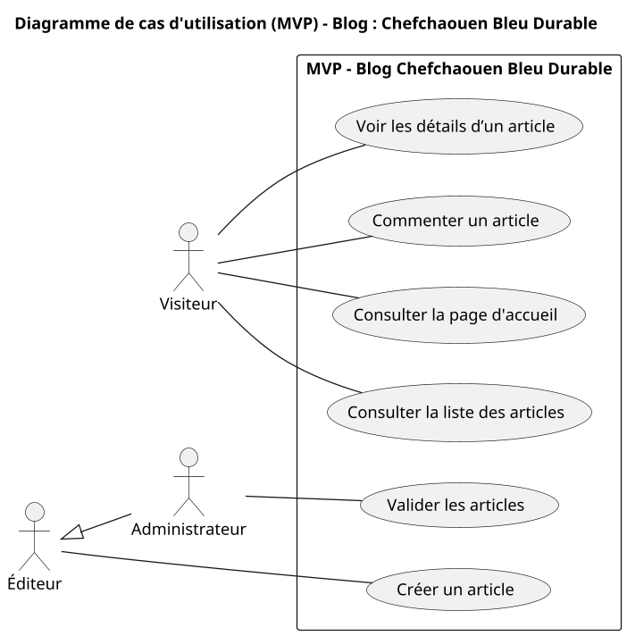

# Context

## 🎯 **1. Contexte du projet**

Blog collaboratif **“Chefchaouen Bleu Durable”** dédié à la promotion du **tourisme durable et responsable** dans la région de **Chefchaouen**.  
L’objectif est de **mettre en valeur la beauté naturelle et culturelle** de la ville bleue tout en **encourageant les pratiques écologiques** et la **sensibilisation à la durabilité**.

---

## 🎨 **2. Style & Design**

* Design **moderne, élégant et minimaliste** inspiré des **teintes bleues de Chefchaouen** 💙  
* **Palette de couleurs** :  
  - Bleu clair `#A3BECD`  
  - Bleu moyen `#69CCDD`  
  - Bleu profond `#3294B1`  
  - Gris doux `#DFE2E6`  
* Utilisation de **dégradés de bleus**, **animations légères sur les titres** et **effets hover** sur les **boutons** et **cartes**.  
* Typographie claire, lisible et harmonieuse.  
* **Structure aérée**, visuels de nature, culture et artisanat local.  
* Framework : **Aucun framework**, uniquement **HTML + CSS (Tailwind CSS)**.

---

## 🧱 **3. Pages à prévoir**

### 🌐 **Espace Public**
* **Page d’accueil (Accueil)**
* **Page liste des articles (Articles)**
* **Page de détails d’un article (Détail Article)**

### 🔐 **Espace Administrateur / Éditeur**
* **Gestion des articles (CRUD complet)**
* **Validation des articles** avant publication

---

## 📌 **4. Sections principales**

* **Navbar fixe** avec deux liens : *Accueil* et *Articles*  
* **Section d’introduction** avec image représentative de Chefchaouen + slogan sur le tourisme durable  
* **Liste d’articles** sous forme de **cartes animées** (image, titre, auteur, extrait)  
* **Page Détail Article** avec contenu complet, image, auteur et commentaires  
* **Footer** : informations, contact, réseaux sociaux

---

## 🧑‍🤝‍🧑 **5. Expérience utilisateur (UX)**

* Navigation fluide et intuitive  
* **Effets d’animation sur les titres** et **hover sur les cartes et boutons**  
* **Responsive Design** (mobile / tablette / desktop)  
* Lecture agréable grâce à une mise en page épurée et bien structurée  
* Interaction simplifiée (commenter, lire, parcourir les articles facilement)

---

## ⚙️ **6. Technologies**

* **HTML + Tailwind CSS**  
* **Aucune bibliothèque JavaScript complexe**  
* **Animations CSS simples et légères**  

---

## ✍️ **7. Format attendu**

* **Code HTML + CSS propre et commenté**  
* **Responsive** sur tous les écrans  
* **Structure claire** et réutilisable  
* **Animations et hover inclus**

---

## 📊 **Diagramme de cas d'utilisation — MVP “Chefchaouen Bleu Durable”**

---

## 🗂️ **Plan du site — Blog “Chefchaouen Bleu Durable”**

### 🌿 **Espace Public**

| Page                 | Description                                                                 |
|----------------------|------------------------------------------------------------------------------|
| **Accueil**          | Page d’introduction avec slogan, image de Chefchaouen et liens vers articles, Use section 'à propos' décrit le blog, use sectio affiche seulement 3 articles avec button 'voir plus', une section 'notre mission' contient les missions sous forme de cartes |
| **Articles**         | Liste d’articles présentée en cartes (image, titre, extrait, auteur)         |
| **Détail Article**   | Contenu complet d’un article avec image, auteur et section de commentaires   |

---

### 🔐 **Espace Administrateur / Éditeur**

| Page                     | Description                                                          |
|---------------------------|---------------------------------------------------------------------|
| **Dashboard Admin**       | Vue globale sur les articles                                        |
| **Créer un Article**      | Formulaire pour rédiger un article (titre, image, contenu, auteur)  |
| **Modifier un Article**   | Modification du contenu d’un article existant                       |
| **Supprimer un Article**  | Suppression d’un article avec confirmation                          |
| **Valider un Article**    | Validation avant publication sur le site                            |

---

### 🛠️ **Fonctionnalités Clés**

✅ Navigation claire entre Accueil / Articles  
✅ CRUD des articles (admin/éditeur)  
✅ Page détail avec commentaires  
✅ Design élégant, fluide et réactif  
✅ Couleurs bleues inspirées de Chefchaouen  
✅ Animations CSS sur titres, cartes et boutons  

---

💡 **Note :**  
Les maquettes doivent refléter **une ambiance bleue et sereine**, avec des sections équilibrées, des boutons aux coins légèrement arrondis, et des **animations douces** au survol pour évoquer la tranquillité et la beauté de **Chefchaouen**.
